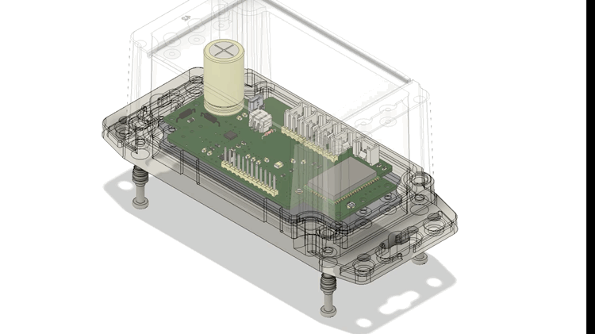
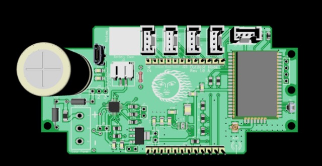
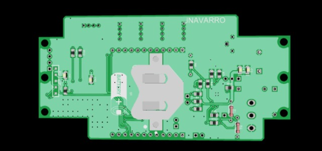
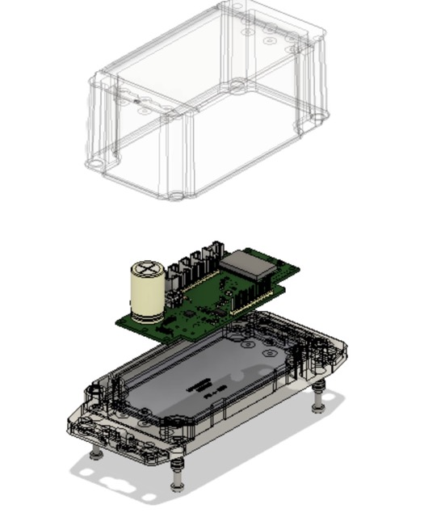

# outdoor-lora-sensor-node

Design for a watertight outdoor LoRa sensor node with optional solar energy harvesting and interchangeable MCU boards. 

## LoRa module

Microchip RN2903 LoRaWAN module

## Energy harvesting

Cypress/Infeneon S6AE101A0DGNAB000

## Battery charger

Microchip MCP73871-2CCI/ML

## Enclosure

Hammond Mfg. 1555CF42GY

## MCU options

Cypress PSoC 4
Atmega32u4
Atmega328

## Pictures

### Assembly with enclosure sim

### Top

### Bottom

### Assembly pictures

## License

Released under the Creative Commons Attribution 4.0 License
https://creativecommons.org/licenses/by/4.0/